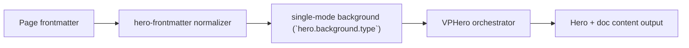

# Single Shader Background

Primary focus: `hero.background.shader` preset + uniforms.

## Built-in Presets

`water`, `galaxy`, `plasma`, `noise`, `ripple`, `silk`

## Silk Example

```yaml
hero:
  background:
    type: shader
    shader:
      type: silk
      speed: 0.72
      uniforms:
        uColor1:
          type: vec3
          value: [0.86, 0.9, 0.8]
        uColor2:
          type: vec3
          value: [0.75, 0.82, 0.67]
        uColor3:
          type: vec3
          value: [0.62, 0.71, 0.56]
```

## Actual Frontmatter Used

The YAML below is the exact full frontmatter used by this page. Copy it to reproduce the same result.

```yaml
---
layout: home
hero:
  name: "Single Background"
  text: "Shader"
  tagline: "Tres shader preset with theme-aware uniforms and theme-aware uniforms."
  background:
    type: shader
    shader:
      type: water
      uniforms:
        u_intensity:
          light: 0.62
          dark: 0.48
  actions:
    - theme: brand
      text: "Particles Case"
      link: /en-US/hero/matrix/backgroundSingle/particles
features:
  - title: "Tres Runtime"
    details: "Shader rendering runs in client branch only for SSR safety."
---
```

## API Keys Demonstrated

| Key | All Config |
|---|---|
| `hero.background.type` + subtype payload | [Background Root](../../../AllConfig) |
| `hero.background.opacity/brightness/contrast/saturation/filter` | [Background Root](../../../AllConfig) |
| `hero.background.cssVars/style` | [Background Root](../../../AllConfig) |

## Configuration Focus

This page focuses on **one renderer per hero with theme sync and theme-sync behavior**.
Primary contract area: single-mode background (`hero.background.type`).

## Field Notes

| Topic | Guidance |
|-------|----------|
| Primary fields | `type`, subtype payload (`image\|video\|color\|shader\|particles`) |
| Global controls | `opacity`, `brightness`, `contrast`, `saturation`, `filter` |

## Runtime Flow Diagram


