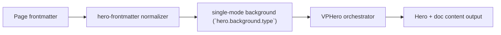

# Single Video Background

Primary focus: `hero.background.video` contract.

## Actual Frontmatter Used

The YAML below is the exact full frontmatter used by this page. Copy it to reproduce the same result.

```yaml
---
layout: home
hero:
    name: "Single Background"
    text: "Video"
    tagline: "Video background with explicit media-layer controls."
    background:
        type: video
        video:
            src: "https://interactive-examples.mdn.mozilla.net/media/cc0-videos/flower.mp4"
            muted: true
            autoplay: true
            loop: true
            fit: cover
            position: center
    actions:
        - theme: brand
          text: "Shader Case"
          link: /en-US/hero/matrix/backgroundSingle/shader
features:
    - title: "Media Contract"
---
```

## API Keys Demonstrated

| Key                                                             | All Config                                         |
| --------------------------------------------------------------- | -------------------------------------------------- |
| `hero.background.type` + subtype payload                        | [Background Root](../../../AllConfig)   |
| `hero.background.opacity/brightness/contrast/saturation/filter` | [Background Root](../../../AllConfig)   |
| `hero.background.cssVars/style`                                 | [Background Root](../../../AllConfig)   |

## Configuration Focus

This page focuses on **one renderer per hero with formal theme-sync behavior**.
Primary contract area: single-mode background (`hero.background.type`).

## Field Notes

| Topic           | Guidance                                                    |
| --------------- | ----------------------------------------------------------- |
| Primary fields  | `type`, subtype payload (`image\|video\|color\|shader\|particles`) |
| Global controls | `opacity`, `brightness`, `contrast`, `saturation`, `filter` |

## Runtime Flow Diagram


