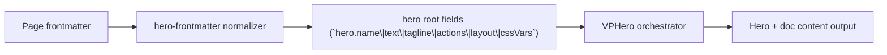

# Level 1 Minimal

Primary focus: base hero content contract.

## Actual Frontmatter Used

The YAML below is the exact full frontmatter used by this page. Copy it to reproduce the same result.

```yaml
---
layout: home
hero:
  name: "Hero Runtime"
  text: "Level 1"
  tagline: "Minimal home hero with default viewport framing and no advanced effects."
  actions:
    - theme: brand
      text: "Next Level"
      link: /en-US/hero/matrix/basic/level2ViewportActions
features:
  - title: "Focused"
    details: "Only title, text, tagline, and actions are configured."
  - title: "Stable"
    details: "No background/image override means safest baseline."
  - title: "Default"
    details: "hero.layout.viewport defaults to true."
---
```

## API Keys Demonstrated

| Key | All Config |
|---|---|
| `hero.name`, `hero.text`, `hero.tagline` | [Hero Root](../../../AllConfig) |
| `hero.layout.viewport` | [Hero Root](../../../AllConfig) |
| `hero.actions[]` | [Hero Root](../../../AllConfig) |
| page-level `cssVars` | [Hero Root](../../../AllConfig) |

## Configuration Focus

This page focuses on **core hero information architecture and page-level styling variables**.
Primary contract area: hero root fields (`hero.name\|text\|tagline\|actions\|layout\|cssVars`).

## Field Notes

| Topic | Guidance |
|-------|----------|
| Primary fields | `hero.name`, `hero.text`, `hero.tagline`, `hero.actions[]` |
| Layout control | `hero.layout.viewport` controls full-screen framing |
| Styling scope | `cssVars` is page-scoped and affects this page only |

## Runtime Flow Diagram



