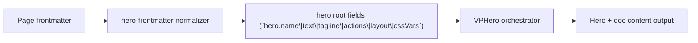

# Level 2 Viewport + Actions

Primary focus: layout viewport toggle and button theme contract.

## Actual Frontmatter Used

The YAML below is the exact full frontmatter used by this page. Copy it to reproduce the same result.

```yaml
---
layout: home
hero:
  name: "Hero Runtime"
  text: "Level 2"
  tagline: "Switch to content-height mode and tune action themes only."
  layout:
    viewport: false
  actions:
    - theme: brand
      text: "Brand Action"
      link: /en-US/hero/matrix/basic/level3PageCssvars
    - theme: alt
      text: "Alt Action"
      link: /en-US/hero/matrix/index
    - theme: outline
      text: "Outline Action"
      link: /en-US/hero/matrix/buttonsFeatures/buttonsThemes
features:
  - title: "Viewport Toggle"
    details: "hero.layout.viewport=false keeps hero height content-driven."
  - title: "Action Contract"
    details: "theme/text/link remain compatible with existing runtime usage."
---
```

## API Keys Demonstrated

| Key | All Config |
|---|---|
| `hero.name`, `hero.text`, `hero.tagline` | [Hero Root](../../../AllConfig) |
| `hero.layout.viewport` | [Hero Root](../../../AllConfig) |
| `hero.actions[]` | [Hero Root](../../../AllConfig) |
| page-level `cssVars` | [Hero Root](../../../AllConfig) |

## Configuration Focus

This page focuses on **core hero information architecture and page-level styling variables**.
Primary contract area: hero root fields (`hero.name\|text\|tagline\|actions\|layout\|cssVars`).

## Field Notes

| Topic | Guidance |
|-------|----------|
| Primary fields | `hero.name`, `hero.text`, `hero.tagline`, `hero.actions[]` |
| Layout control | `hero.layout.viewport` controls full-screen framing |
| Styling scope | `cssVars` is page-scoped and affects this page only |

## Runtime Flow Diagram



