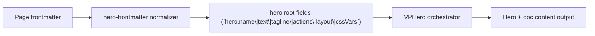

# Level 3 Page cssVars

Primary focus: top-level page-scoped CSS variable contract.

## Actual Frontmatter Used

The YAML below is the exact full frontmatter used by this page. Copy it to reproduce the same result.

```yaml
---
layout: home
cssVars:
  --vp-home-hero-name-color:
    light: "rgba(220, 134, 76, 0.48)"
    dark: "rgba(199, 205, 219, 0.48)"
hero:
  name: "Hero Runtime"
  text: "Level 3"
  tagline: "Page-scoped cssVars should only affect this page scope."
  actions:
    - theme: brand
      text: "Single Background"
      link: /en-US/hero/matrix/backgroundSingle/
features:
  - title: "Page Scope"
    details: "Top-level cssVars are applied to current page layout scope only."
  - title: "Non-Global"
    details: "No global document-root style mutation is allowed for these keys."
---
```

## API Keys Demonstrated

| Key | All Config |
|---|---|
| `hero.name`, `hero.text`, `hero.tagline` | [Hero Root](../../../AllConfig) |
| `hero.layout.viewport` | [Hero Root](../../../AllConfig) |
| `hero.actions[]` | [Hero Root](../../../AllConfig) |
| page-level `cssVars` | [Hero Root](../../../AllConfig) |

## Configuration Focus

This page focuses on **core hero information architecture and page-level styling variables**.
Primary contract area: hero root fields (`hero.name\|text\|tagline\|actions\|layout\|cssVars`).

## Field Notes

| Topic | Guidance |
|-------|----------|
| Primary fields | `hero.name`, `hero.text`, `hero.tagline`, `hero.actions[]` |
| Layout control | `hero.layout.viewport` controls full-screen framing |
| Styling scope | `cssVars` is page-scoped and affects this page only |

## Runtime Flow Diagram



