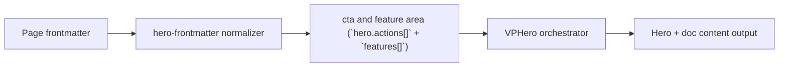

# Buttons Theme Matrix

Primary focus: button theme contract and restrained hover behavior.

## Actual Frontmatter Used

The YAML below is the exact full frontmatter used by this page. Copy it to reproduce the same result.

```yaml
---
layout: home
hero:
  name: "Buttons"
  text: "Theme Matrix"
  tagline: "Professional button interactions without cheap scale/lift behavior."
  actions:
    - theme: brand
      text: "Brand"
      link: /en-US/hero/matrix/buttonsFeatures/featuresScroll
    - theme: alt
      text: "Alt"
      link: /en-US/hero/matrix/index
    - theme: outline
      text: "Outline"
      link: /en-US/hero/AllConfig
    - theme: ghost
      text: "Ghost"
      link: /en-US/hero/AllConfig
features:
  - title: "Subtle Motion"
    details: "Transition emphasis is color, border, and shadow; no aggressive scaling."
---
```

## API Keys Demonstrated

| Key | All Config |
|---|---|
| `hero.actions[]` | [Hero Root](../../../AllConfig) |
| `features[]` | [All Config](../../../AllConfig) |
| `featuresConfig.scroll.*` | [All Config](../../../AllConfig) |
| `featuresConfig.cards.width*` | [All Config](../../../AllConfig) |

## Configuration Focus

This page focuses on **interaction styling and below-hero feature presentation**.
Primary contract area: cta and feature area (`hero.actions[]` + `features[]`).

## Field Notes

| Topic | Guidance |
|-------|----------|
| Action contract | `actions[].text`, `actions[].link`, optional theme/target/rel |
| Feature contract | `features[].title`, `features[].details`, optional icon/link |
| UX quality | restrained hover, strong focus-visible, docs-first legibility |

## Runtime Flow Diagram


