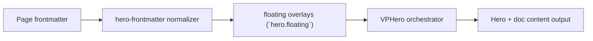

# Floating Level 1

Primary focus: text item styles defined per item.

## Actual Frontmatter Used

The YAML below is the exact full frontmatter used by this page. Copy it to reproduce the same result.

```yaml
---
layout: home
hero:
  name: "Floating"
  text: "Level 1"
  tagline: "Start with text-only floating items using per-item style fields."
  floating:
    enabled: true
    opacity: 0.9
    density: 8
    motion:
      enabled: true
      style: drift
      durationMin: 14
      durationMax: 24
    items:
      - type: text
        text: "Docs Platform"
        x: "12%"
        y: "24%"
        colorType: gradient
        gradient: "linear-gradient(120deg,rgba(47, 94, 166, 1) 0%,rgba(109, 149, 216, 1) 100%)"
      - type: text
        text: "Theme Synced"
        x: "74%"
        y: "26%"
      - type: text
        text: "Frontmatter"
        x: "64%"
        y: "72%"
        colorType: solid
        color:
          light: "rgba(38, 75, 130, 1)"
          dark: "rgba(169, 196, 243, 1)"
  actions:
    - theme: brand
      text: "Level 2"
      link: /en-US/hero/matrix/floating/level2Cards
---
```

## API Keys Demonstrated

| Key | All Config |
|---|---|
| `hero.floating.enabled/items[]` | [Floating Root](../../../AllConfig) |
| `hero.floating.opacity/density/blur/gradients` | [Floating Root](../../../AllConfig) |
| `hero.floating.motion.*` | [Floating Root](../../../AllConfig) |
| per-item motion overrides | [Floating Root](../../../AllConfig) |

## Configuration Focus

This page focuses on **decorative moving items with per-item positioning and motion overrides**.
Primary contract area: floating overlays (`hero.floating`).

## Field Notes

| Topic | Guidance |
|-------|----------|
| Global controls | `enabled`, `opacity`, `density`, `blur`, `motion.*` |
| Item model | `items[]` with shared position/rotation/motion fields |
| Type surface | `text\|card\|image\|badge\|icon\|stat\|code\|shape` |

## Runtime Flow Diagram



