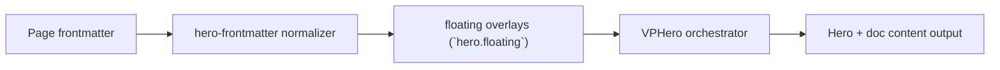

# Floating Level 2

Primary focus: card items in per-item configuration style.

## Actual Frontmatter Used

The YAML below is the exact full frontmatter used by this page. Copy it to reproduce the same result.

```yaml
---
layout: home
hero:
  name: "Floating"
  text: "Level 2"
  tagline: "Add card items and keep defaults simple and item-driven."
  floating:
    enabled: true
    opacity: 0.92
    density: 10
    gradients:
      - "linear-gradient(120deg,rgba(15, 76, 154, 1) 0%,rgba(47, 111, 192, 1) 50%,rgba(106, 163, 232, 1) 100%)"
      - "linear-gradient(120deg,rgba(10, 122, 106, 1) 0%,rgba(19, 144, 124, 1) 52%,rgba(71, 184, 159, 1) 100%)"
    items:
      - type: card
        title: "Runtime Complete"
        description: "Shader, particles, waves, model3d are all config-driven."
        x: "8%"
        y: "22%"
      - type: card
        title: "Readable by Default"
        description: "Media backgrounds are guarded by contrast mode."
        x: "66%"
        y: "64%"
      - type: text
        text: "Per-item style only"
        x: "64%"
        y: "20%"
        colorType: random-gradient
  actions:
    - theme: brand
      text: "Level 3"
      link: /en-US/hero/matrix/floating/level3Mixed
---
```

## API Keys Demonstrated

| Key | All Config |
|---|---|
| `hero.floating.enabled/items[]` | [Floating Root](../../../AllConfig) |
| `hero.floating.opacity/density/blur/gradients` | [Floating Root](../../../AllConfig) |
| `hero.floating.motion.*` | [Floating Root](../../../AllConfig) |
| per-item motion overrides | [Floating Root](../../../AllConfig) |

## Configuration Focus

This page focuses on **decorative moving items with per-item positioning and motion overrides**.
Primary contract area: floating overlays (`hero.floating`).

## Field Notes

| Topic | Guidance |
|-------|----------|
| Global controls | `enabled`, `opacity`, `density`, `blur`, `motion.*` |
| Item model | `items[]` with shared position/rotation/motion fields |
| Type surface | `text\|card\|image\|badge\|icon\|stat\|code\|shape` |

## Runtime Flow Diagram



