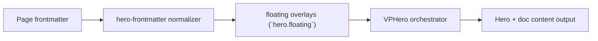

# Floating Level 3

Primary focus: full item-type matrix.

## Actual Frontmatter Used

The YAML below is the exact full frontmatter used by this page. Copy it to reproduce the same result.

```yaml
---
layout: home
hero:
  name: "Floating"
  text: "Level 3"
  tagline: "Mixed cards, badges, icons, stats, code, images, and text."
  floating:
    enabled: true
    opacity: 0.94
    density: 12
    motion:
      enabled: true
      style: drift
      drift: 30
      durationMin: 12
      durationMax: 22
    items:
      - type: card
        title: "Project Health"
        description: "Build and matrix checks passing."
        x: "10%"
        y: "22%"
      - type: image
        src:
          light: /logo.png
          dark: /logodark.png
        alt:
          light: "Template logo (light theme)"
          dark: "Template logo (dark theme)"
        x: "82%"
        y: "64%"
        width: "110px"
      - type: lottie
        src:
          light: "https://raw.githubusercontent.com/b-wils/lottiefiles-test-files/main/data/layers/precomp.json"
          dark: "https://raw.githubusercontent.com/b-wils/lottiefiles-test-files/main/data/layers/precomp.json"
        alt:
          light: "Lottie precomp test (light theme)"
          dark: "Lottie precomp test (dark theme)"
        x: "76%"
        y: "18%"
        width: "120px"
        speed: 0.8
      - type: badge
        text:
          light: "Enterprise Docs"
          dark: "Enterprise Docs · Dark"
        icon:
          light: "✨"
          dark: "🌙"
        x: "56%"
        y: "12%"
      - type: icon
        icon:
          light: "⚙️"
          dark: "🛠️"
        x: "6%"
        y: "52%"
      - type: stat
        value: "99.95%"
        title: "Uptime"
        x: "58%"
        y: "56%"
      - type: code
        code: "hero.waves.enabled: true"
        x: "30%"
        y: "72%"
      - type: shape
        shape: hexagon
        x: "90%"
        y: "42%"
      - type: text
        text: "Frontmatter Extension Ready"
        x: "34%"
        y: "16%"
        colorType: random-gradient
  actions:
    - theme: brand
      text: "Buttons & Features"
      link: /en-US/hero/matrix/buttonsFeatures/index
---
```

## API Keys Demonstrated

| Key | All Config |
|---|---|
| `hero.floating.enabled/items[]` | [Floating Root](../../../AllConfig) |
| `hero.floating.opacity/density/blur/gradients` | [Floating Root](../../../AllConfig) |
| `hero.floating.motion.*` | [Floating Root](../../../AllConfig) |
| per-item motion overrides | [Floating Root](../../../AllConfig) |

## Configuration Focus

This page focuses on **decorative moving items with per-item positioning and motion overrides**.
Primary contract area: floating overlays (`hero.floating`).

## Field Notes

| Topic | Guidance |
|-------|----------|
| Global controls | `enabled`, `opacity`, `density`, `blur`, `motion.*` |
| Item model | `items[]` with shared position/rotation/motion fields |
| Type surface | `text\|card\|image\|lottie\|badge\|icon\|stat\|code\|shape` |

## Runtime Flow Diagram


