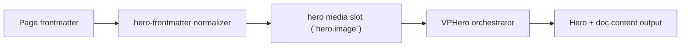

# GIF Frame

Primary focus: gif source + frame sizing.

## Actual Frontmatter Used

The YAML below is the exact full frontmatter used by this page. Copy it to reproduce the same result.

```yaml
---
layout: home
hero:
  name: "Image Type"
  text: "GIF"
  tagline: "GIF uses the same frame contract and media fit controls."
  image:
    type: gif
    gif:
      src: "https://media.giphy.com/media/13HgwGsXF0aiGY/giphy.gif"
      autoplay: true
      loop: true
      fit: cover
    frame:
      shape: rounded
      width: 360px
      height: 280px
      radius: 24px
  actions:
    - theme: brand
      text: "Video Frame"
      link: /en-US/hero/matrix/imageTypes/videoFrame
---
```

## API Keys Demonstrated

| Key | All Config |
|---|---|
| `hero.image.type` + subtype object | [Image Root](../../../AllConfig) |
| `hero.image.width/height/fit/position` | [Image Root](../../../AllConfig) |
| `hero.image.background.enabled` | [Image Root](../../../AllConfig) |
| `hero.image.frame.*` | [Frame](../../../AllConfig) |

## Configuration Focus

This page focuses on **media rendering modes and frame shaping for hero visual slot**.
Primary contract area: hero media slot (`hero.image`).

## Field Notes

| Topic | Guidance |
|-------|----------|
| Type switch | `type: image\|video\|gif\|model3d` |
| Subtype payload | match payload key with selected type |
| Framing | `hero.image.frame` controls shape, border, shadow, clip-path |

## Runtime Flow Diagram



