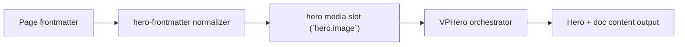

# Image Frame

Primary focus: `hero.image.frame` shape and surface.

## Actual Frontmatter Used

The YAML below is the exact full frontmatter used by this page. Copy it to reproduce the same result.

```yaml
---
layout: home
hero:
  name: "Image Type"
  text: "Image + Frame"
  tagline: "Frame shape controls are shared across image/gif/video/model3d."
  image:
    type: image
    image:
      src: /logo.png
      fit: contain
    frame:
      shape: squircle
      width: 340px
      height: 340px
      padding: 20px
      border: "1px solid rgba(148, 163, 184, 0.45)"
      background:
        light: "rgba(255, 255, 255, 0.86)"
        dark: "rgba(10, 16, 30, 0.66)"
  actions:
    - theme: brand
      text: "GIF Frame"
      link: /en-US/hero/matrix/imageTypes/gifFrame
---
```

## API Keys Demonstrated

| Key | All Config |
|---|---|
| `hero.image.type` + subtype object | [Image Root](../../../AllConfig) |
| `hero.image.width/height/fit/position` | [Image Root](../../../AllConfig) |
| `hero.image.background.enabled` | [Image Root](../../../AllConfig) |
| `hero.image.frame.*` | [Frame](../../../AllConfig) |

## Configuration Focus

This page focuses on **media rendering modes and frame shaping for hero visual slot**.
Primary contract area: hero media slot (`hero.image`).

## Field Notes

| Topic | Guidance |
|-------|----------|
| Type switch | `type: image\|video\|gif\|model3d` |
| Subtype payload | match payload key with selected type |
| Framing | `hero.image.frame` controls shape, border, shadow, clip-path |

## Runtime Flow Diagram



