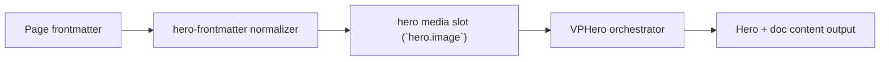

# Lottie Frame

Primary focus: lottie media in hero image slot with frame controls.

## Actual Frontmatter Used

The YAML below is the exact full frontmatter used by this page. Copy it to reproduce the same result.

```yaml
---
layout: home
hero:
    name: "Image Type"
    text: "Lottie"
    tagline: "Lottie hero image should remain stable inside frame shape with configurable speed and renderer."
    image:
        type: lottie
        lottie:
            src: "https://raw.githubusercontent.com/b-wils/lottiefiles-test-files/main/data/properties/scalar-linear.json"
            loop: true
            autoplay: true
            speed: 1
            renderer: svg
            fit: contain
        frame:
            shape: rounded
            width: 360px
            height: 300px
            radius: 24px
            border: "1px solid rgba(148, 163, 184, 0.45)"
            background:
                light: "rgba(255, 255, 255, 0.84)"
                dark: "rgba(10, 16, 30, 0.62)"
    actions:
        - theme: brand
          text: "Frame Layout"
          link: /en-US/hero/matrix/imageTypes/frameLayoutFit
---
```

## API Keys Demonstrated

| Key                                              | All Config                       |
| ------------------------------------------------ | -------------------------------- |
| `hero.image.type: lottie`                        | [Image Root](../../../AllConfig) |
| `hero.image.lottie.src/light/dark`               | [Image Root](../../../AllConfig) |
| `hero.image.lottie.loop/autoplay/speed/renderer` | [Image Root](../../../AllConfig) |
| `hero.image.frame.*`                             | [Frame](../../../AllConfig)      |

## Configuration Focus

This page focuses on **Lottie rendering in the hero image slot and shared frame contract behavior**.
Primary contract area: hero media slot (`hero.image`).

## Field Notes

| Topic          | Guidance                                                     |
| -------------- | ------------------------------------------------------------ |
| Type switch    | `type: image\|video\|gif\|model3d\|lottie`                   |
| Lottie payload | `hero.image.lottie` contains source and playback options     |
| Framing        | `hero.image.frame` controls shape, border, shadow, clip-path |

## Runtime Flow Diagram



