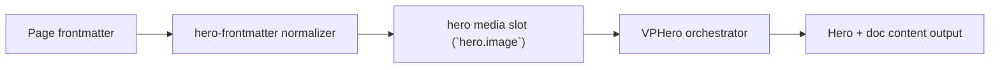

# Model3D Centered

Primary focus: non-clipped 3D model framing.

## Actual Frontmatter Used

The YAML below is the exact full frontmatter used by this page. Copy it to reproduce the same result.

```yaml
---
layout: home
hero:
  name: "Image Type"
  text: "Model3D"
  tagline: "Model is centered and auto-fitted to avoid clipping by frame."
  image:
    type: model3d
    model3d:
      src: /models/duck.glb
      fitPadding: 1.36
      animation:
        enabled: true
        type: float
      interaction:
        enabled: true
        autoRotate: true
        autoRotateSpeed: 0.7
    frame:
      shape: rounded
      width: 420px
      height: 330px
      radius: 20px
      background:
        light: "rgba(245, 248, 255, 0.86)"
        dark: "rgba(8, 14, 26, 0.74)"
  actions:
    - theme: brand
      text: "Floating Elements"
      link: /en-US/hero/matrix/floating/index
features:
  - title: "Centered"
    details: "Model runtime recenters geometry and adjusts camera distance automatically."
---
```

## API Keys Demonstrated

| Key | All Config |
|---|---|
| `hero.image.type` + subtype object | [Image Root](../../../AllConfig) |
| `hero.image.width/height/fit/position` | [Image Root](../../../AllConfig) |
| `hero.image.background.enabled` | [Image Root](../../../AllConfig) |
| `hero.image.frame.*` | [Frame](../../../AllConfig) |

## Configuration Focus

This page focuses on **media rendering modes and frame shaping for hero visual slot**.
Primary contract area: hero media slot (`hero.image`).

## Field Notes

| Topic | Guidance |
|-------|----------|
| Type switch | `type: image\|video\|gif\|model3d` |
| Subtype payload | match payload key with selected type |
| Framing | `hero.image.frame` controls shape, border, shadow, clip-path |

## Runtime Flow Diagram



