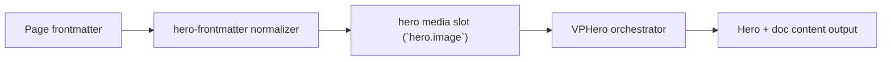

# Video Frame

Primary focus: video media inside custom frame bounds.

## Actual Frontmatter Used

The YAML below is the exact full frontmatter used by this page. Copy it to reproduce the same result.

```yaml
---
layout: home
hero:
  name: "Image Type"
  text: "Video"
  tagline: "Video hero image should remain contained inside frame shape."
  image:
    type: video
    video:
      src: "https://interactive-examples.mdn.mozilla.net/media/cc0-videos/flower.mp4"
      muted: true
      autoplay: true
      loop: true
      fit: cover
    frame:
      shape: rounded
      width: 380px
      height: 300px
      radius: 24px
      overflow: hidden
  actions:
    - theme: brand
      text: "Model3D"
      link: /en-US/hero/matrix/imageTypes/model3dCentered
---
```

## API Keys Demonstrated

| Key | All Config |
|---|---|
| `hero.image.type` + subtype object | [Image Root](../../../AllConfig) |
| `hero.image.width/height/fit/position` | [Image Root](../../../AllConfig) |
| `hero.image.background.enabled` | [Image Root](../../../AllConfig) |
| `hero.image.frame.*` | [Frame](../../../AllConfig) |

## Configuration Focus

This page focuses on **media rendering modes and frame shaping for hero visual slot**.
Primary contract area: hero media slot (`hero.image`).

## Field Notes

| Topic | Guidance |
|-------|----------|
| Type switch | `type: image\|video\|gif\|model3d` |
| Subtype payload | match payload key with selected type |
| Framing | `hero.image.frame` controls shape, border, shadow, clip-path |

## Runtime Flow Diagram



