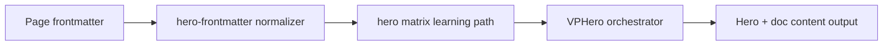

# Hero Config Matrix

This matrix is the canonical testing and learning set for hero frontmatter.

## Structure (Nested)

```text
hero/matrix/
  backgroundSingle/
    color/
    image/
    video/
    shader/
    particles/
  layers/
    level1TwoLayers.md
    level2ThreeLayers.md
    ...
  basic/
    level1Minimal.md
    level2ViewportActions.md
    ...
  waves/
    level1Default.md
    level2ShapeOpacity.md
    ...
  imageTypes/
    imageFrame.md
    videoFrame.md
    gifFrame.md
    model3dCentered.md
  floating/
    level1Text.md
    level2Cards.md
    level3Mixed.md
  buttonsFeatures/
    buttonsThemes.md
    featuresScroll.md
```

## Progression Rules

1. Each page focuses on one primary config domain.
2. Complexity increases level by level.
3. Layer pages are cumulative and show realistic compositions.
4. Visual baseline stays docs-first and contrast-safe.
5. Each showcase page includes the exact frontmatter used plus API key mapping.
6. Full API coverage is centralized in exactly one page: [All Hero Configuration](../AllConfig).

## Suggested Study Order (Demo First)

1. [Basic](./basic/)
2. [Single Background](./backgroundSingle/)
3. [Layered Background](./layers/)
4. [Waves](./waves/)
5. [Image Types](./imageTypes/)
6. [Floating Elements](./floating/)
7. [Buttons & Features](./buttonsFeatures/)
8. [Configuration Coverage Map](./configCoverage)
9. [All Hero Configuration](../AllConfig)

## Navigation Hubs

- [Basic](./basic/)
- [Single Background](./backgroundSingle/)
- [Layered Background](./layers/)
- [Waves](./waves/)
- [Image Types](./imageTypes/)
- [Floating Elements](./floating/)
- [Buttons & Features](./buttonsFeatures/)
- [Configuration Coverage Map](./configCoverage)
- [All Hero Configuration](../AllConfig)

## Configuration Focus

This page focuses on **progressive domain learning from root hero config to advanced composition**.
Primary contract area: hero matrix learning path.

## Field Notes

| Topic | Guidance |
|-------|----------|
| Study order | basic -> background -> layers -> waves -> image -> floating -> buttons/features |
| Validation method | Open each page and verify both hero render and below-doc explanation |
| Contract source | Use `AllConfig` for the full field defaults and constraints |
| Coverage source | Use `configCoverage` page to map keys to demos |

## Runtime Flow Diagram



