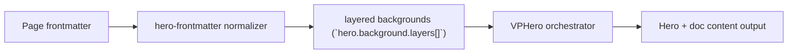

# Layers Level 1

Primary focus: basic `background.layers` composition.

## Actual Frontmatter Used

The YAML below is the exact full frontmatter used by this page. Copy it to reproduce the same result.

```yaml
---
layout: home
hero:
  name: "Layers"
  text: "Level 1"
  tagline: "Start with two layers: image base + color overlay."
  background:
    layers:
      - type: image
        zIndex: 1
        image:
          src: "https://images.unsplash.com/photo-1523240795612-9a054b0db644?auto=format&fit=crop&w=1800&q=80"
          size: cover
          position: center
      - type: color
        zIndex: 2
        opacity: 0.46
        color:
          solid:
            color:
              light: "rgba(236, 243, 255, 1)"
              dark: "rgba(11, 23, 48, 1)"
  actions:
    - theme: brand
      text: "Level 2"
      link: /en-US/hero/matrix/layers/level2ThreeLayers
features:
  - title: "Stack Order"
    details: "zIndex controls visual composition order."
---
```

## API Keys Demonstrated

| Key | All Config |
|---|---|
| `hero.background.layers[]` | [Layers Root](../../../AllConfig) |
| `layers[].zIndex/opacity/blend` | [Layers Root](../../../AllConfig) |
| `layers[].style/cssVars` | [Layers Root](../../../AllConfig) |

## Configuration Focus

This page focuses on **stacking multiple renderers with explicit z-index and blending**.
Primary contract area: layered backgrounds (`hero.background.layers[]`).

## Field Notes

| Topic | Guidance |
|-------|----------|
| Ordering | `zIndex` sorts render order from back to front |
| Compositing | `blend` and `opacity` tune visual integration |

## Runtime Flow Diagram



