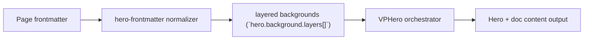

# Layers Level 2

Primary focus: video + blend composition.

## Actual Frontmatter Used

The YAML below is the exact full frontmatter used by this page. Copy it to reproduce the same result.

```yaml
---
layout: home
hero:
  name: "Layers"
  text: "Level 2"
  tagline: "Add a video layer and explicit blend control."
  background:
    layers:
      - type: video
        zIndex: 1
        video:
          src: "https://interactive-examples.mdn.mozilla.net/media/cc0-videos/flower.mp4"
          muted: true
          autoplay: true
          loop: true
          fit: cover
      - type: color
        zIndex: 2
        opacity: 0.34
        blend: multiply
        color:
          solid:
            color:
              light: "rgba(218, 231, 255, 1)"
              dark: "rgba(10, 22, 48, 1)"
      - type: color
        zIndex: 3
        opacity: 0.22
        blend: screen
        color:
          solid:
            color:
              light: "rgba(248, 251, 255, 1)"
              dark: "rgba(31, 49, 95, 1)"
  actions:
    - theme: brand
      text: "Level 3"
      link: /en-US/hero/matrix/layers/level3ShaderParticles
features:
  - title: "Blend Modes"
    details: "Layer-level blend controls let you tune media intensity safely."
---
```

## API Keys Demonstrated

| Key | All Config |
|---|---|
| `hero.background.layers[]` | [Layers Root](../../../AllConfig) |
| `layers[].zIndex/opacity/blend` | [Layers Root](../../../AllConfig) |
| `layers[].style/cssVars` | [Layers Root](../../../AllConfig) |

## Configuration Focus

This page focuses on **stacking multiple renderers with explicit z-index and blending**.
Primary contract area: layered backgrounds (`hero.background.layers[]`).

## Field Notes

| Topic | Guidance |
|-------|----------|
| Ordering | `zIndex` sorts render order from back to front |
| Compositing | `blend` and `opacity` tune visual integration |

## Runtime Flow Diagram



