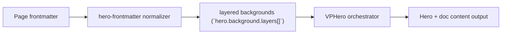

# Layers Level 3

Primary focus: shader + particles in layered mode.

## Actual Frontmatter Used

The YAML below is the exact full frontmatter used by this page. Copy it to reproduce the same result.

```yaml
---
layout: home
hero:
  name: "Layers"
  text: "Level 3"
  tagline: "Add shader and particles while preserving theme sync and docs hierarchy."
  background:
    layers:
      - type: color
        zIndex: 1
        color:
          gradient:
            enabled: true
            type: linear
            direction: 140deg
            stops:
              - color:
                  light: "rgba(245, 249, 255, 1)"
                  dark: "rgba(10, 20, 42, 1)"
                position: "0%"
              - color:
                  light: "rgba(232, 241, 255, 1)"
                  dark: "rgba(18, 37, 66, 1)"
                position: "100%"
      - type: shader
        zIndex: 2
        opacity: 0.58
        shader:
          type: ripple
      - type: particles
        zIndex: 3
        opacity: 0.75
        particles:
          type: snow
          count: 130
          movement:
            turbulence: 0.28
  actions:
    - theme: brand
      text: "Level 4"
      link: /en-US/hero/matrix/layers/level4FullThemeSync
features:
  - title: "Effects as Layers"
    details: "Shader and particles remain optional enhancement layers."
---
```

## API Keys Demonstrated

| Key | All Config |
|---|---|
| `hero.background.layers[]` | [Layers Root](../../../AllConfig) |
| `layers[].zIndex/opacity/blend` | [Layers Root](../../../AllConfig) |
| `layers[].style/cssVars` | [Layers Root](../../../AllConfig) |

## Configuration Focus

This page focuses on **stacking multiple renderers with explicit z-index and blending**.
Primary contract area: layered backgrounds (`hero.background.layers[]`).

## Field Notes

| Topic | Guidance |
|-------|----------|
| Ordering | `zIndex` sorts render order from back to front |
| Compositing | `blend` and `opacity` tune visual integration |

## Runtime Flow Diagram



