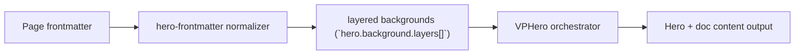

# Layers Level 4

Primary focus: full-stack layered composition.

## Actual Frontmatter Used

The YAML below is the exact full frontmatter used by this page. Copy it to reproduce the same result.

```yaml
---
layout: home
hero:
  name: "Layers"
  text: "Level 4"
  tagline: "Full theme-synced composition with scoped cssVars and runtime filters."
  background:
    opacity: 1
    brightness: 1
    contrast: 1
    saturation: 1.02
    cssVars:
      layer-overlay-color:
        light: "rgba(255, 255, 255, 0.16)"
        dark: "rgba(15, 30, 56, 0.34)"
    layers:
      - type: image
        zIndex: 1
        image:
          light: "https://images.unsplash.com/photo-1522075469751-3a6694fb2f61?auto=format&fit=crop&w=1800&q=80"
          dark: "https://images.unsplash.com/photo-1517248135467-4c7edcad34c4?auto=format&fit=crop&w=1800&q=80"
          size: cover
      - type: shader
        zIndex: 2
        opacity: 0.42
        shader:
          type: water
          uniforms:
            u_intensity:
              light: 0.6
              dark: 0.4
      - type: particles
        zIndex: 3
        particles:
          type: sparks
          count: 110
          appearance:
            opacity:
              light: 0.32
              dark: 0.72
      - type: color
        zIndex: 4
        opacity: 0.2
        style:
          background: "var(--layer-overlay-color)"
  waves:
    enabled: true
    animated: true
    speed: 0.08
    height: 90
  actions:
    - theme: brand
      text: "Waves"
      link: /en-US/hero/matrix/waves/index
features:
  - title: "Scoped Tokens"
    details: "hero.background.cssVars affect this hero background only."
  - title: "Theme Sync"
    details: "image/shader/particles values can all be light-dark aware."
---
```

## API Keys Demonstrated

| Key | All Config |
|---|---|
| `hero.background.layers[]` | [Layers Root](../../../AllConfig) |
| `layers[].zIndex/opacity/blend` | [Layers Root](../../../AllConfig) |
| `layers[].style/cssVars` | [Layers Root](../../../AllConfig) |

## Configuration Focus

This page focuses on **stacking multiple renderers with explicit z-index and blending**.
Primary contract area: layered backgrounds (`hero.background.layers[]`).

## Field Notes

| Topic | Guidance |
|-------|----------|
| Ordering | `zIndex` sorts render order from back to front |
| Compositing | `blend` and `opacity` tune visual integration |

## Runtime Flow Diagram



