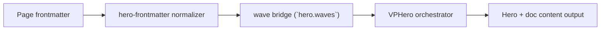

# Waves Level 1

Primary focus: minimal canonical wave configuration.

## Actual Frontmatter Used

The YAML below is the exact full frontmatter used by this page. Copy it to reproduce the same result.

```yaml
---
layout: home
hero:
  name: "Waves"
  text: "Level 1"
  tagline: "Canonical wave bridge using hero.waves only."
  waves:
    enabled: true
    animated: true
    height: 86
    opacity: 1
  actions:
    - theme: brand
      text: "Level 2"
      link: /en-US/hero/matrix/waves/level2ShapeOpacity
features:
  - title: "Canonical"
    details: "Use hero.waves, not hero.background.type=waves."
---
```

## API Keys Demonstrated

| Key | All Config |
|---|---|
| `hero.waves.enabled/animated/height/opacity` | [Waves Root](../../../AllConfig) |
| `hero.waves.speed/color/reversed/outline/zIndex` | [Waves Root](../../../AllConfig) |
| `hero.waves.layers[]` | [Wave Layers](../../../AllConfig) |

## Configuration Focus

This page focuses on **hero-to-content boundary shaping and motion tuning**.
Primary contract area: wave bridge (`hero.waves`).

## Field Notes

| Topic | Guidance |
|-------|----------|
| Boundary role | Waves bridge hero section to document body, not background type |
| Shape tuning | `height`, layer `amplitude/frequency/opacity` |
| Motion tuning | `animated`, `speed`, and per-layer `direction` |

## Runtime Flow Diagram



