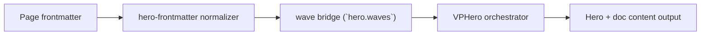

# Waves Level 2

Primary focus: smooth visual continuity at hero-content seam.

## Actual Frontmatter Used

The YAML below is the exact full frontmatter used by this page. Copy it to reproduce the same result.

```yaml
---
layout: home
hero:
  name: "Waves"
  text: "Level 2"
  tagline: "Adjust smoothness using amplitude and layer opacity, not sharp edges."
  waves:
    enabled: true
    animated: true
    height: 100
    speed: 0.095
    layers:
      - amplitude: 30
        wavelength: 240
        opacity: 0.22
      - amplitude: 24
        wavelength: 200
        opacity: 0.5
      - amplitude: 18
        wavelength: 170
        opacity: 0.92
  actions:
    - theme: brand
      text: "Level 3"
      link: /en-US/hero/matrix/waves/level3MobileTuning
features:
  - title: "Softer Edge"
    details: "Amplitude, wavelength, and opacity together control perceived sharpness."
---
```

## API Keys Demonstrated

| Key | All Config |
|---|---|
| `hero.waves.enabled/animated/height/opacity` | [Waves Root](../../../AllConfig) |
| `hero.waves.speed/color/reversed/outline/zIndex` | [Waves Root](../../../AllConfig) |
| `hero.waves.layers[]` | [Wave Layers](../../../AllConfig) |

## Configuration Focus

This page focuses on **hero-to-content boundary shaping and motion tuning**.
Primary contract area: wave bridge (`hero.waves`).

## Field Notes

| Topic | Guidance |
|-------|----------|
| Boundary role | Waves bridge hero section to document body, not background type |
| Shape tuning | `height`, layer `amplitude/frequency/opacity` |
| Motion tuning | `animated`, `speed`, and per-layer `direction` |

## Runtime Flow Diagram



